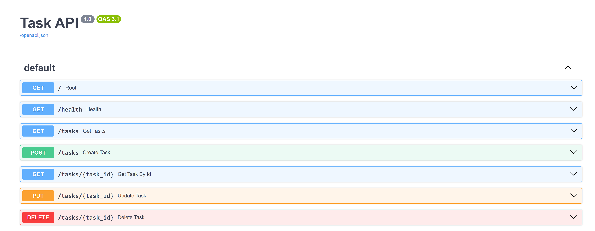

# Task API

A simple CRUD API for managing a to-do list, built with FastAPI. Supports creating, reading, updating, and deleting tasks, with in-memory storage and interactive Swagger docs.

## How to run

1. Clone this repo and navigate into it:

git clone https://github.com/Favour-Orifa/basic_crud_app.git
cd basic_crud_app

2. Create and activate a virtual environment:

python -m venv myenv
myenv\Scripts\Activate.ps1

3. Install dependencies:

pip install -r requirements.txt

4. Run the server:

uvicorn app:app --reload

5. Visit `http://localhost:8000/docs` to explore the API interactively.

## Endpoints

| Method | Path | Description |
|--------|------|-------------|
| GET | `/` | API info and available endpoints |
| GET | `/health` | Health check |
| GET | `/tasks` | List all tasks |
| GET | `/tasks/{id}` | Get a single task by id |
| POST | `/tasks` | Create a new task |
| PUT | `/tasks/{id}` | Update a task's title and/or done status |
| DELETE | `/tasks/{id}` | Delete a task |

## Example request

curl -i http://localhost:8000/tasks

HTTP/1.1 200 OK
date: Thu, 24 Sep 2026 12:25:45 GMT
server: uvicorn
content-length: 136
content-type: application/json

[{"id":1,"title":"Buy milk","done":false},{"id":2,"title":"walk the dog","done":false},{"id":3,"title":"finish assignment","done":true}]

## Swagger UI

 

## Notes

This project was built as part of the FlyRank Internship Backend Track, Week 2.
